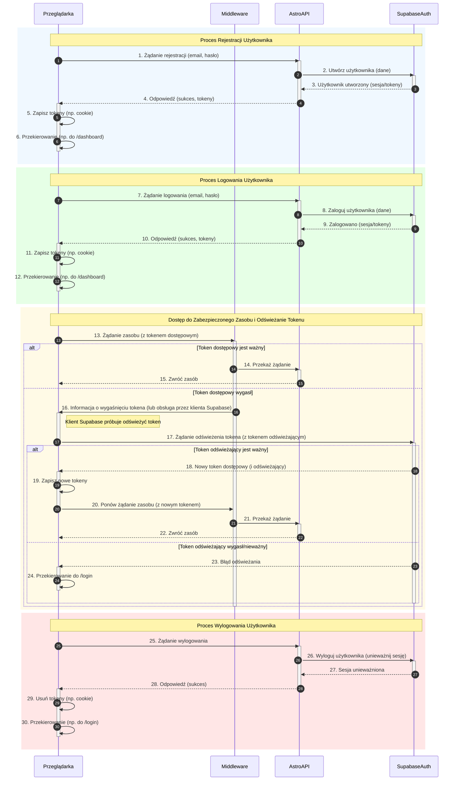

```mermaid
sequenceDiagram
    autonumber
    participant Przeglądarka
    participant Middleware
    participant AstroAPI
    participant SupabaseAuth

    rect rgb(240, 248, 255)
        note over Przeglądarka, SupabaseAuth: Proces Rejestracji Użytkownika
        Przeglądarka->>AstroAPI: 1. Żądanie rejestracji (email, hasło)
        activate AstroAPI
        AstroAPI->>SupabaseAuth: 2. Utwórz użytkownika (dane)
        activate SupabaseAuth
        SupabaseAuth-->>AstroAPI: 3. Użytkownik utworzony (sesja/tokeny)
        deactivate SupabaseAuth
        AstroAPI-->>Przeglądarka: 4. Odpowiedź (sukces, tokeny)
        deactivate AstroAPI
        activate Przeglądarka
        Przeglądarka->>Przeglądarka: 5. Zapisz tokeny (np. cookie)
        Przeglądarka->>Przeglądarka: 6. Przekierowanie (np. do /dashboard)
        deactivate Przeglądarka
    end

    rect rgb(230, 255, 230)
        note over Przeglądarka, SupabaseAuth: Proces Logowania Użytkownika
        Przeglądarka->>AstroAPI: 7. Żądanie logowania (email, hasło)
        activate AstroAPI
        AstroAPI->>SupabaseAuth: 8. Zaloguj użytkownika (dane)
        activate SupabaseAuth
        SupabaseAuth-->>AstroAPI: 9. Zalogowano (sesja/tokeny)
        deactivate SupabaseAuth
        AstroAPI-->>Przeglądarka: 10. Odpowiedź (sukces, tokeny)
        deactivate AstroAPI
        activate Przeglądarka
        Przeglądarka->>Przeglądarka: 11. Zapisz tokeny (np. cookie)
        Przeglądarka->>Przeglądarka: 12. Przekierowanie (np. do /dashboard)
        deactivate Przeglądarka
    end

    rect rgb(255, 250, 230)
        note over Przeglądarka, SupabaseAuth: Dostęp do Zabezpieczonego Zasobu i Odświeżanie Tokenu
        Przeglądarka->>Middleware: 13. Żądanie zasobu (z tokenem dostępowym)
        activate Middleware

        alt Token dostępowy jest ważny
            Middleware->>AstroAPI: 14. Przekaż żądanie
            activate AstroAPI
            AstroAPI-->>Przeglądarka: 15. Zwróć zasób
            deactivate AstroAPI
        else Token dostępowy wygasł
            Middleware->>Przeglądarka: 16. Informacja o wygaśnięciu tokena (lub obsługa przez klienta Supabase)
            activate Przeglądarka
            note right of Przeglądarka: Klient Supabase próbuje odświeżyć token
            Przeglądarka->>SupabaseAuth: 17. Żądanie odświeżenia tokena (z tokenem odświeżającym)
            deactivate Przeglądarka
            activate SupabaseAuth
            alt Token odświeżający jest ważny
                SupabaseAuth-->>Przeglądarka: 18. Nowy token dostępowy (i odświeżający)
                activate Przeglądarka
                Przeglądarka->>Przeglądarka: 19. Zapisz nowe tokeny
                Przeglądarka->>Middleware: 20. Ponów żądanie zasobu (z nowym tokenem)
                deactivate Przeglądarka
                Middleware->>AstroAPI: 21. Przekaż żądanie
                activate AstroAPI
                AstroAPI-->>Przeglądarka: 22. Zwróć zasób
                deactivate AstroAPI
            else Token odświeżający wygasł/nieważny
                SupabaseAuth-->>Przeglądarka: 23. Błąd odświeżania
                activate Przeglądarka
                Przeglądarka->>Przeglądarka: 24. Przekierowanie do /login
                deactivate Przeglądarka
            end
            deactivate SupabaseAuth
        end
        deactivate Middleware
    end

    rect rgb(255, 230, 230)
        note over Przeglądarka, SupabaseAuth: Proces Wylogowania Użytkownika
        Przeglądarka->>AstroAPI: 25. Żądanie wylogowania
        activate AstroAPI
        AstroAPI->>SupabaseAuth: 26. Wyloguj użytkownika (unieważnij sesję)
        activate SupabaseAuth
        SupabaseAuth-->>AstroAPI: 27. Sesja unieważniona
        deactivate SupabaseAuth
        AstroAPI-->>Przeglądarka: 28. Odpowiedź (sukces)
        deactivate AstroAPI
        activate Przeglądarka
        Przeglądarka->>Przeglądarka: 29. Usuń tokeny (np. cookie)
        Przeglądarka->>Przeglądarka: 30. Przekierowanie (np. do /login)
        deactivate Przeglądarka
    end
``` 