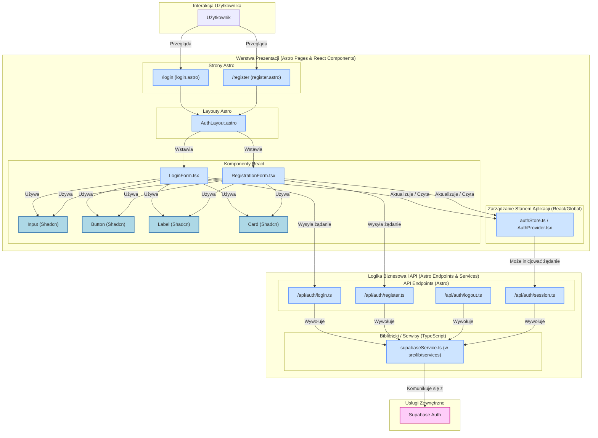

```mermaid
flowchart TD
    classDef newComponent fill:#cde4ff,stroke:#6699ff,stroke-width:2px;
    classDef astroPage fill:#FFDEAD,stroke:#FFA500,stroke-width:2px;
    classDef reactComp fill:#ADD8E6,stroke:#4682B4,stroke-width:2px;
    classDef apiEndpoint fill:#LIGHTGREEN,stroke:#2E8B57,stroke-width:2px;
    classDef serviceLib fill:#E6E6FA,stroke:#9370DB,stroke-width:2px;
    classDef externalService fill:#FECDF9,stroke:#C71585,stroke-width:2px;
    classDef layoutComp fill:#FFFACD,stroke:#FFD700,stroke-width:2px;
    classDef stateMgmt fill:#F0FFF0,stroke:#3CB371,stroke-width:2px;

    subgraph "Interakcja Użytkownika"
        U[Użytkownik]
    end

    subgraph "Warstwa Prezentacji (Astro Pages & React Components)"
        direction LR
        subgraph "Strony Astro"
            LoginPg["/login (login.astro)"]:::astroPage
            RegisterPg["/register (register.astro)"]:::astroPage
        end

        subgraph "Layouty Astro"
            AuthLayout["AuthLayout.astro"]:::layoutComp
        end

        subgraph "Komponenty React"
            LoginForm["LoginForm.tsx"]:::reactComp
            RegisterForm["RegistrationForm.tsx"]:::reactComp
            ShadcnInput["Input (Shadcn)"]:::reactComp
            ShadcnButton["Button (Shadcn)"]:::reactComp
            ShadcnLabel["Label (Shadcn)"]:::reactComp
            ShadcnCard["Card (Shadcn)"]:::reactComp
        end
        
        subgraph "Zarządzanie Stanem Aplikacji (React/Global)"
            AuthStore["authStore.ts / AuthProvider.tsx"]:::stateMgmt
        end

        LoginPg --> AuthLayout
        RegisterPg --> AuthLayout
        AuthLayout -- Wstawia --> LoginForm
        AuthLayout -- Wstawia --> RegisterForm

        LoginForm -- Używa --> ShadcnInput
        LoginForm -- Używa --> ShadcnButton
        LoginForm -- Używa --> ShadcnLabel
        LoginForm -- Używa --> ShadcnCard
        RegisterForm -- Używa --> ShadcnInput
        RegisterForm -- Używa --> ShadcnButton
        RegisterForm -- Używa --> ShadcnLabel
        RegisterForm -- Używa --> ShadcnCard
        
        LoginForm -- Aktualizuje / Czyta --> AuthStore
        RegisterForm -- Aktualizuje / Czyta --> AuthStore
    end

    subgraph "Logika Biznesowa i API (Astro Endpoints & Services)"
        direction LR
        subgraph "API Endpoints (Astro)"
            ApiLogin["/api/auth/login.ts"]:::apiEndpoint
            ApiRegister["/api/auth/register.ts"]:::apiEndpoint
            ApiLogout["/api/auth/logout.ts"]:::apiEndpoint
            ApiSession["/api/auth/session.ts"]:::apiEndpoint
        end

        subgraph "Biblioteki / Serwisy (TypeScript)"
            SupabaseService["supabaseService.ts (w src/lib/services)"]:::serviceLib
        end
    end

    subgraph "Usługi Zewnętrzne"
        SupabaseAuth["Supabase Auth"]:::externalService
    end

    U -- Przegląda --> LoginPg
    U -- Przegląda --> RegisterPg

    LoginForm -- Wysyła żądanie --> ApiLogin
    RegisterForm -- Wysyła żądanie --> ApiRegister
    
    %% Dostęp do API sesji i wylogowania może być z różnych miejsc (np. z globalnego layoutu, komponentu nawigacji)
    AuthStore -- Może inicjować żądanie --> ApiSession
    %% Komponent np. PrzyciskWyloguj (nie w tym diagramie) --> ApiLogout

    ApiLogin -- Wywołuje --> SupabaseService
    ApiRegister -- Wywołuje --> SupabaseService
    ApiLogout -- Wywołuje --> SupabaseService
    ApiSession -- Wywołuje --> SupabaseService

    SupabaseService -- Komunikuje się z --> SupabaseAuth

    %% Zaznaczenie "nowych" komponentów związanych z logowaniem/rejestracją
    class LoginPg,RegisterPg,AuthLayout,LoginForm,RegisterForm,ApiLogin,ApiRegister,ApiLogout,ApiSession,SupabaseService,AuthStore newComponent;
``` 